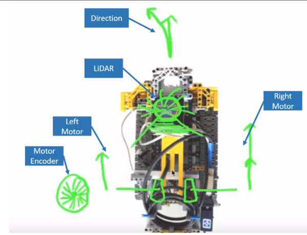
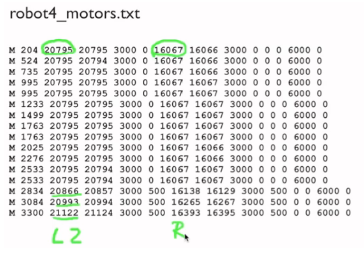
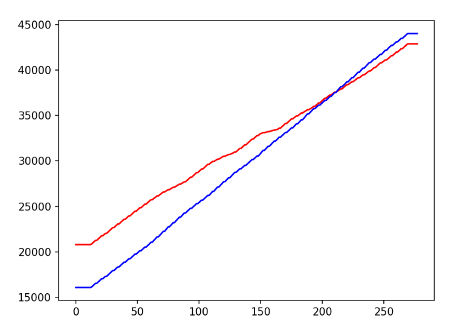
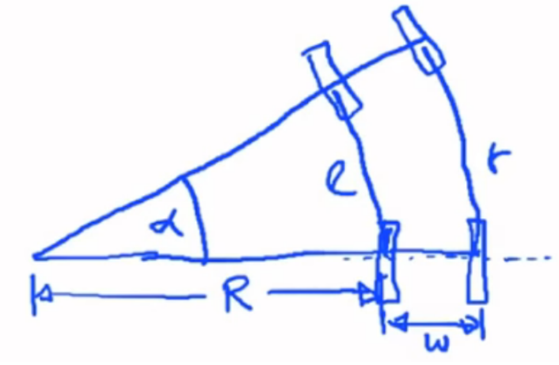
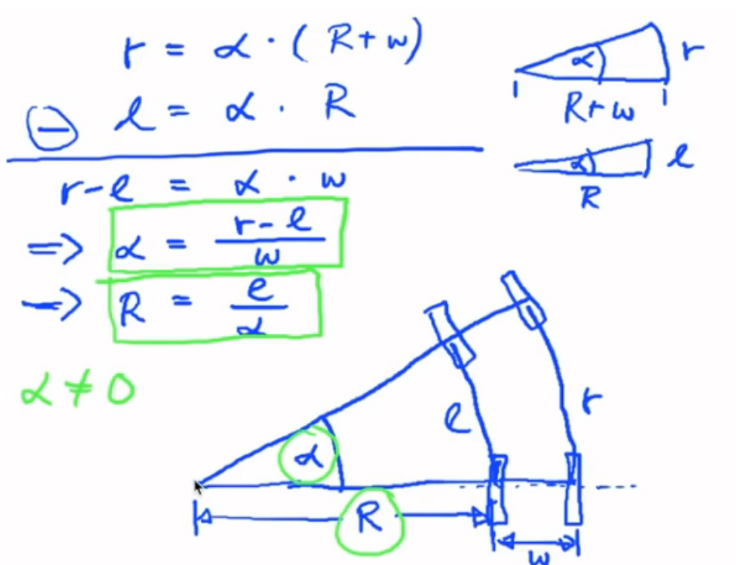
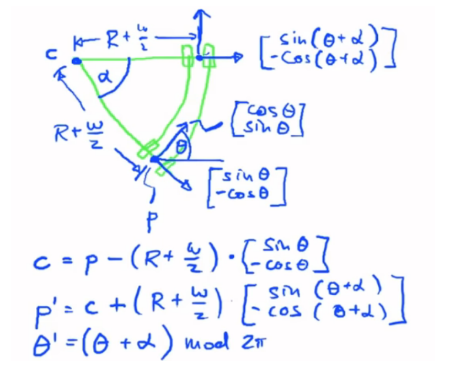
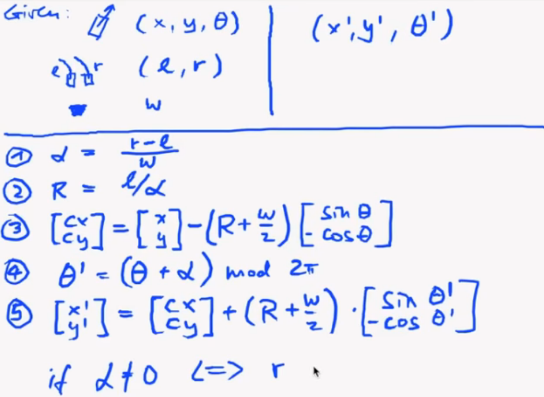
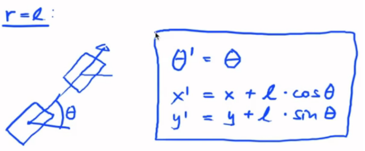

# Unit A: Motion model, Landmark detection and LiDAR data analysis
## Sensor Suite
The robot consists of a 2D LiDAR scanner as the main sensor and wheel encoders to measure position. The wheel encoder counts the ticks per rotation for both the wheels and this helps us compute the distance travelled by the robot in mm. 
> **Note:**
> When the wheel encoders move in different speeds, the robot turns

## Wheel encoder data:
The wheel encoder data is collected in the *robot4_motors.txt* in the following format. 

[Motor, time stamp, left encoder value, #, #, #, right encoder value, #, #, #, #, #, #, #]  

We are interested in the left encoder values (2) and right encoder values (6) of the array. Plotting these we observe the following:

From the following plot, we can infer that the robot is turning since the wheel encoder values are not always equal to each other. 

## Motion Model
We use the bicycle model to represent our robot motion. 

### Derivation and Schematics

**R**: Radius of circular path  
**l**: Length of the circular path of the left wheel   
**r**: Length of the circular path of the right wheel  
**w**: Robot width (baseline)  
**$\alpha$**: Rotation angle  
**p**: Mid-point of the baseline  
**c**: Center around which the robot turns

### Algorithm for position and heading
#### Circular motion: != l or $\alpha$ is not 0

#### Straight motion: r == l

## LiDAR data
