# Unit A: Motion model, Landmark detection and LiDAR data analysis
## Sensor Suite
The robot consists of a 2D LiDAR scanner as the main sensor and wheel encoders to measure position. The wheel encoder counts the ticks per rotation for both the wheels and this helps us compute the distance travelled by the robot in mm. 
> **Note:**
> When the wheel encoders move in different speeds, the robot turns


## Wheel encoder data:
The wheel encoder data is collected in the *robot4_motors.txt* in the following format. 


[Motor, time stamp, left encoder value, #, #, #, right encoder value, #, #, #, #, #, #, #]  

We are interested in the left encoder values (2) and right encoder values (6) of the array. Plotting these we observe the following:


From the following plot, we can infer that the robot is turning since the wheel encoder values are not always equal to each other. 

## Motion Model
We use the bicycle model to represent our robot motion. 

### Derivation and Schematics


  
**R**: Radius of circular path  
**l**: Length of the circular path of the left wheel   
**r**: Length of the circular path of the right wheel  
**w**: Robot width (baseline)  
**$\alpha$**: Rotation angle  
**p**: Mid-point of the baseline  
**c**: Center around which the robot turns

### Algorithm for position and heading
#### Circular motion: r != l or $\alpha$ is not 0


#### Straight motion: r == l


## LiDAR data
Before starting the Lidar data analysis, we have to account for the difference between the LiDAR position and referance frame we use for the bicycle model. 

### Plotting motor ticks and external measurements
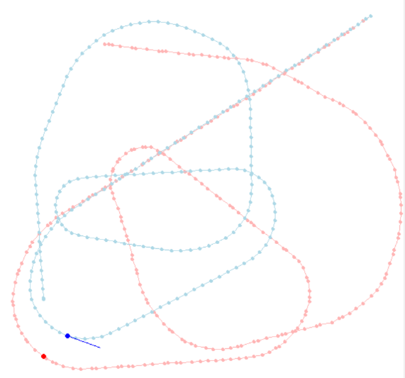

We can observe a drift in the sensor measurement when compared to the external measurements. The deviation seems to start when the robot starts to turn. Part of this can be fixed by calibrating the baseline. A width of 173 seemed to be most suitable.

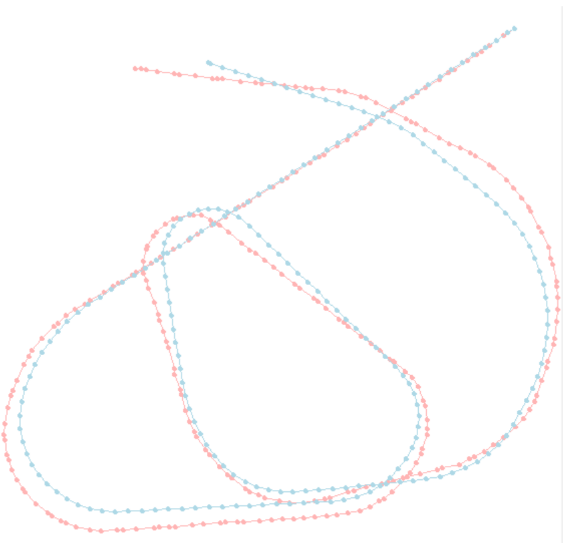

### Plotting LiDAR data
The LiDAR scans the environment at a given interval. Plotting one such scan data we observe the following.

|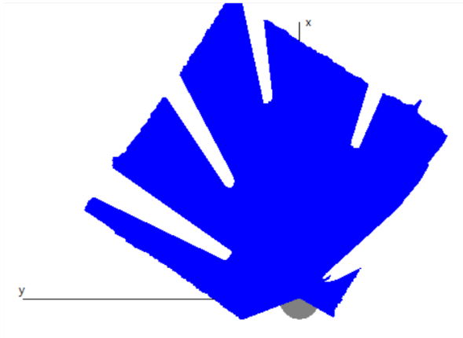|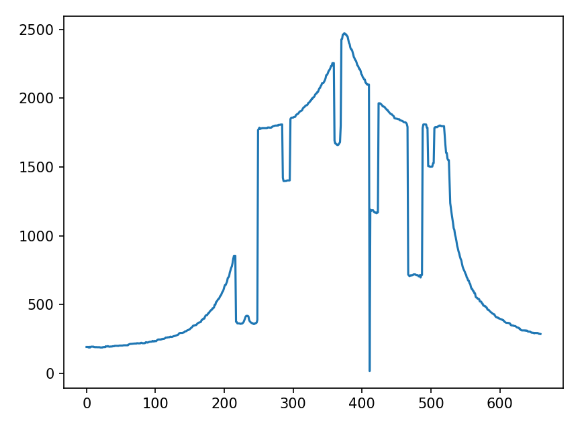|
|--|--|
|Environment visualization|Corresponding scan data|

From the above plot, we can infer a few things. The value near 0 at 405 needs to be a better scan measurement. We will have a threshold to reject such measurements.

Now we need a strategy to associate the cylinders from the scan data. The cylinders will cause a drop in the measurements and spikes when the lidar rays hit the wall.

We can observe steep negative slopes when a cylinder is encountered and steep positive slopes when a cylinder is passed. If we take the derivative at their points and below a certain threshold will detect the beginning of a cylinder using a falling edge, and above a certain threshold, we will mark the end of a cylinder using a rising edge.

How do we find the derivatives?
We will use discrete masks to do so. 

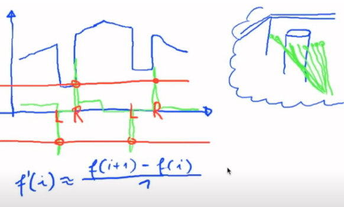

But this function causes a phase shift, and hence we will use a slightly modified version of the above formula.

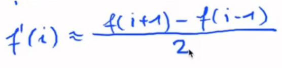

Plotting the derivative term along side the lidar scan data

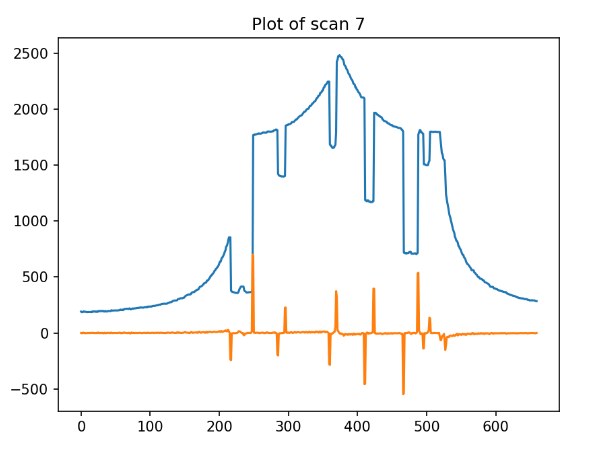

|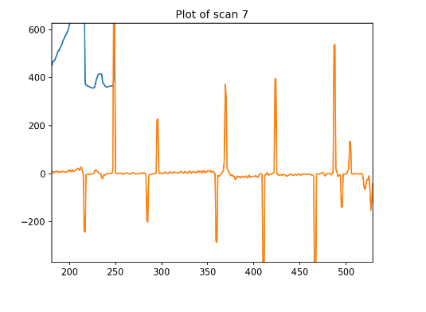|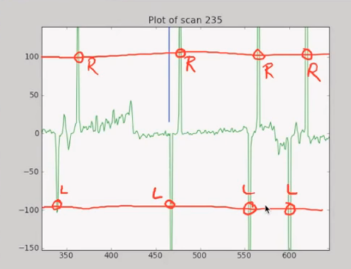|
|--|--|

When we zoom and probe further we can see that the rising and falling edges need a threshold of +-100 and it also ignores random peaks.

## Problems we have to consider
### 1. Cylinder behind a cylinder
There might be a situation where the laser scans hit two cylinders with no gap which will result in two consecutive left edges (or right edges). Over model strictly assumes that a rising edge is followed by a falling edge.

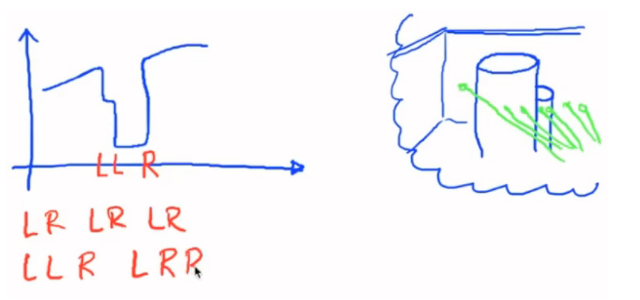

As a work around, a potential solution is to take the average depth and average ray positions. It gives us the following result.

**Algorithm**
```
while (on cylinder){
    1. calculate derivative 'd'
    2. if 'd' <= -thershold then reset counters
    3. else update counters [number of rays, sum of rays value, sum of depths] if ray > some_threshold.
    4. if 'd' > threshold then this marks the end of the cylinder => compute average depth & average ray value.
}
```
|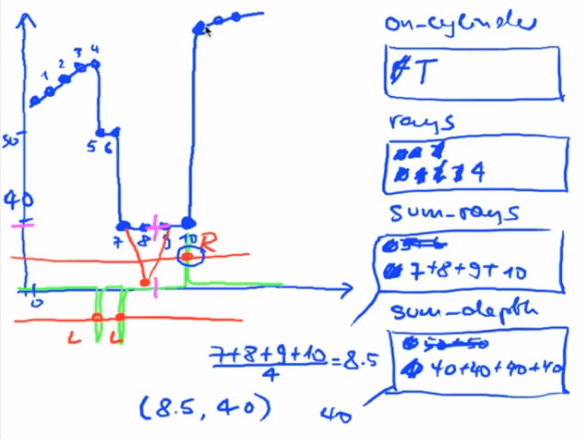|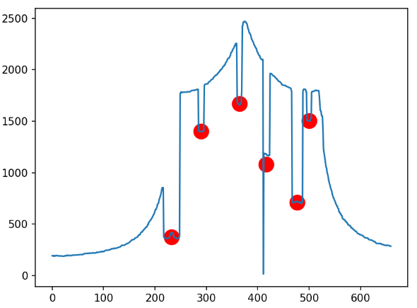|
|--|--|

### 2. Cylinder offset
|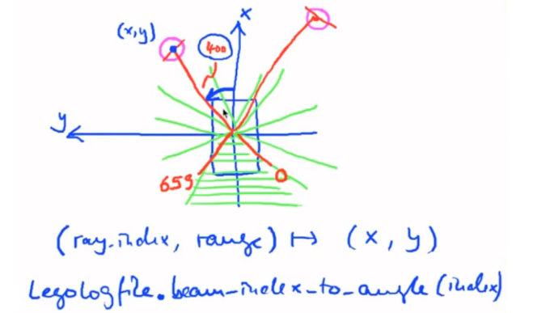|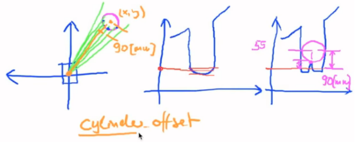|
|--|--|

We have to consider the thickness of the cylinder while computing the derivatives of the depth. The radius of the cylinder causes an offset in the measured position of the cylinder from the scan data.

## Final trajectory
After all the above corrections and computation, we get the following plot whem we plot reference trajectory, sensor trajectory, LiDAR scan points, Absolute landmark positon and computed cylinder positions.

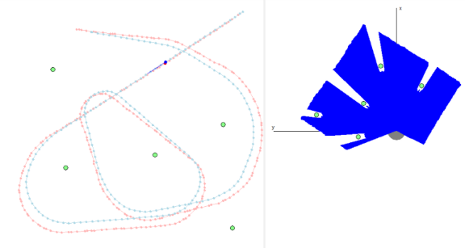

Main take away is that when we turn for the first time, the error in measurement starts to begin. Correspondingly, we also loose track of all landmarks when we turn. This could be one reason why there is a measurement error.