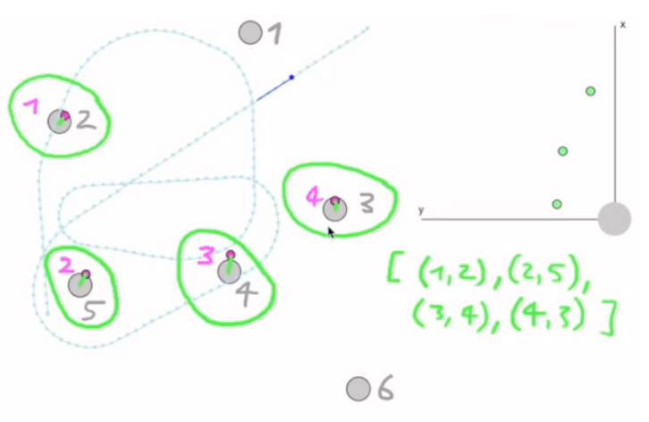

# Unit B: Position estimation and Iterative Close Point algorithm

We are going to find the correspondence between landmarks. Given the robot's pose, we will extract the landmark positions and compute the landmarks' position in the real world. 

